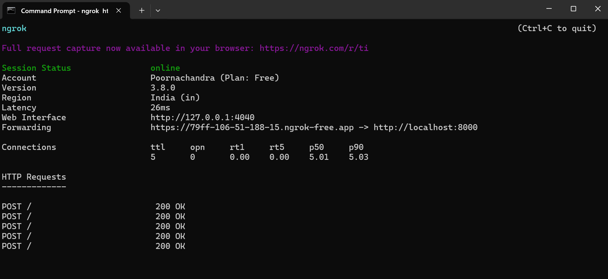
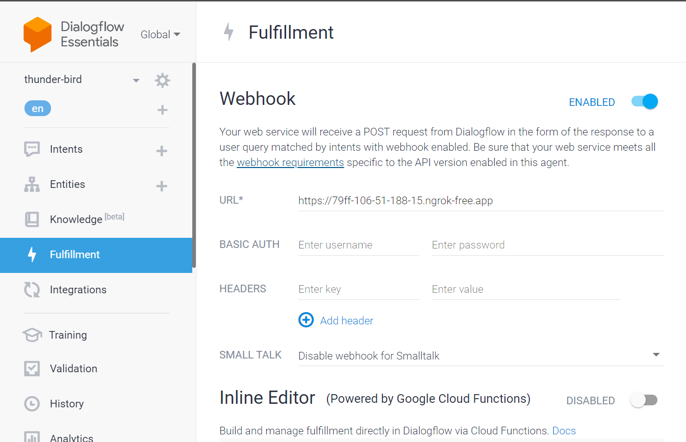

# food_business_chatbot

The food business chatbot for pandeyji's eatery is a comprehensive solution for managing orders and tracking deliveries in a food delivery business. This system is designed to streamline the ordering process, enhance customer experience, and optimize order tracking for efficient delivery management.

## Features

- **Order Management**: Easily place, modify, and complete orders for various food items.
- **Real-time Order Tracking**: Track the status of orders from placement to delivery.
- **Menu Management**: Maintain a dynamic menu of food items with prices and availability.
- **Customer Interaction**: Provide a seamless interaction experience for customers through integration with messaging platforms.

## Technologies Used

- **Python**: Backend development using FastAPI framework for handling HTTP requests.
- **MySQL**: Database management for storing order information and food item details.
- **Dialogflow**: Natural Language Processing (NLP) for understanding user queries and intents.
- **Webhooks**: Integration with messaging platforms to facilitate communication with customers.

## Installation

1. **Clone the repository:**

   ```bash
   git clone https://github.com/yourusername/food-bus-system.git

2. **Install dependencies:**
    ```bash
    pip install -r requirements.txt

3. **Set up Diagflow agent:**
    Create an account on DialogFlow platform and follow  their documentation to set up an agent. Use the provided `training_phrases` file as a template to setup the intents and context. Enable webhooks under the fullfillment tab for necessary intents where communication with the backend is vital.

4. **Set up MySQL database:**
    Execute the SQL script provided in pandeyji_eatery.sql to create the necessary tables and procedures.

5. **Configure environment variables:**
    Set up environment variables for database connection details and API keys as needed.
    
6. **Run the application:**
    Start the server by executing 
    ```
    uvicorn main:app --reload
    ```

    Ngrok is being used here to create a secure tunnel to expose a local server (running on http://localhost:8000) to the internet i.e HTTP is forwared as HTTPS. This was necessary to meet diagflow webhook service requirements.
    Webhook service requirements are as follows:
    - It must handle HTTPS requests. HTTP is not supported. If you host your webhook service on Google Cloud Platform using a Compute or Serverless Computing solution, see the product documentation for serving with HTTPS. For other hosting options, see Get an SSL certificate for your domain.
    - Its URL for requests must be publicly accessible.
    - It must handle POST requests with a JSON WebhookRequest body.
    - It must respond to WebhookRequest requests with a JSON WebhookResponse body. 

    Ngrok tunnels are temporary and only last as long as the Ngrok session is active. Once the session is terminated (usually by stopping Ngrok or restarting your machine), the tunnel will be closed, and the forwarding URL will no longer be accessible.
    

    provide the HTTPS URL here
    

## UI/UX:
HTML-CSS was used to build a simple web page layout with navigation links, sections for different content, and an embedded chatbot.

Here is a demo of the embedded chatbot:

[](https://x.com/iris24244242/status/1776126326195245254)

## Usage

1. **Place an Order:** Customers can place orders by interacting with the system through messaging platforms or a web  interface.

2. **Remove an  existing Order:** Customers removed items before confirming their order.

3. **Track Order Status:** Customers can track the status of their orders in real-time, from order placement to delivery.

4. **Manage Menu:** Admins can manage the menu by adding, updating, or removing food items as needed amd track the order status.


## Acknowledgements
Special thanks to:

- Dhaval Patel (Github: dhavalsays)
